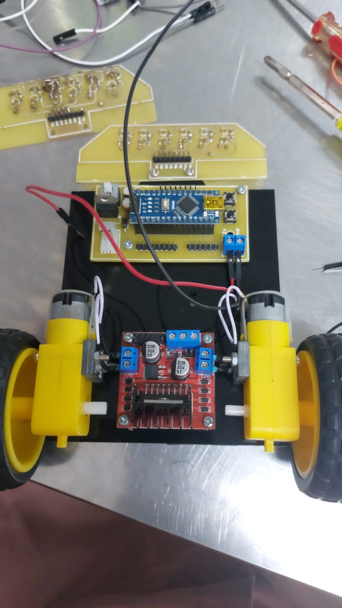

# Firmware Line Follower Robot V2

Dokumentasi teknis kontroler robot pengikut garis berbasis mikrokontroler Arduino Nano, driver motor L298N, dan 6 sensor analog linier[cite: 2]. Sistem mengimplementasikan kendali PID berbasis titik berat (*center of mass*) dengan optimasi pembacaan ADC pada tingkat register.
[cite: 1]

## Fitur Sistem
* **Algoritma PID Kontinu**: Perhitungan posisi garis (-2500 hingga +2500) menggunakan weighted average.
* **Peningkat Kecepatan ADC**: Prescaler 32
* **Penyimpanan Parameter Non-Volatile**: Kalibrasi ambang batas sensor otomatis disimpan pada EEPROM.
* **Manajemen Garis Hilang**: Eksekusi *pivot turn* saat kehilangan jalur di tikungan tajam dan gerakan lurus konstan saat melintasi garis putus-putus.
* **Antarmuka LCD 16x2 & Button**: Navigasi mode kerja (Jalan, Kalibrasi, Tes Sensor)

## Alokasi Pin Mikrokontroler
[cite: 2]

| Komponen | Pin Arduino | Deskripsi / Sinyal |
| :--- | :--- | :--- |
| **Array Sensor** | `A7` – `A2` | Input analog sensor 0 (kiri) hingga 5 (kanan)[cite: 2] |
| **Driver L298N (Kanan)** | `D11`, `D13`, `D12` | `ENA` (PWM), `IN1`, `IN2` (Arah Motor Kanan) |
| **Driver L298N (Kiri)** | `D10`, `D8`, `D9` | `ENB` (PWM), `IN3`, `IN4` (Arah Motor Kiri) |
| **Display LCD 16x2** | `A1`, `A0`, `D2`–`D5` | `RS`, `EN`, `D4`, `D5`, `D6`, `D7` |
| **Tombol Input** | `D7`, `D6` | `Button 1` (OK/Start), `Button 2` (Menu/Stop) |

### Diagram Koneksi L298N
```text
L298N Terminal  -->  Pin Arduino Nano
-----------------------------------
Header 1 (IN3)  -->  D8  (Motor Kiri - Arah A)
Header 2 (IN4)  -->  D9  (Motor Kiri - Arah B)
Header 3 (ENB)  -->  D10 (Motor Kiri - PWM)
Header 4 (ENA)  -->  D11 (Motor Kanan - PWM)
Header 5 (IN2)  -->  D12 (Motor Kanan - Arah A)
Header 6 (IN1)  -->  D13 (Motor Kanan - Arah B)
